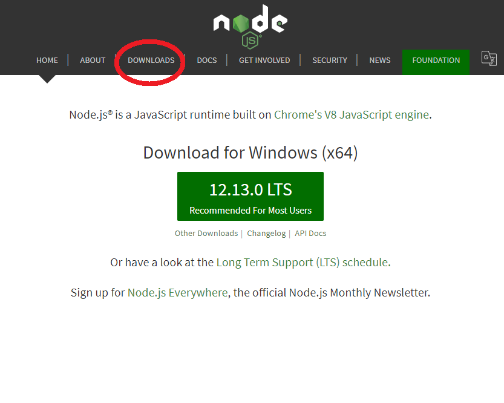
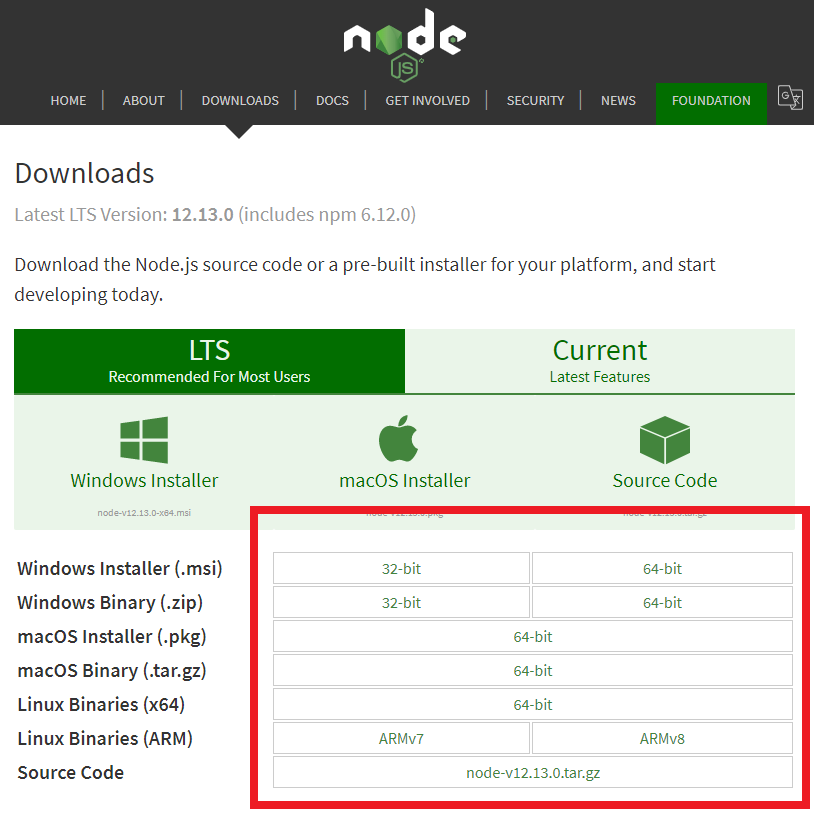

# Installing Node and NPM

## 1. Install Node

- Go to the node [download page](https://nodejs.org/en/download/)
  

- Download the appropriate .zip
  

- Unzip the file to Your "Home Directory"/node
- Add that folder to path
- Restart all applications that will use node (if on windows)

## 2. Run npm install

- Open a terminal (Ctrl + Shift + P on Windows/Linux; CMD + Shift + P on MacOS)
- Type `npm install` and wait